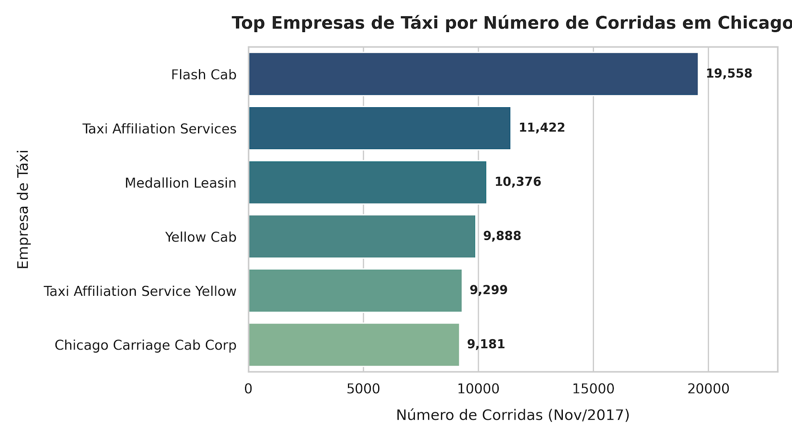
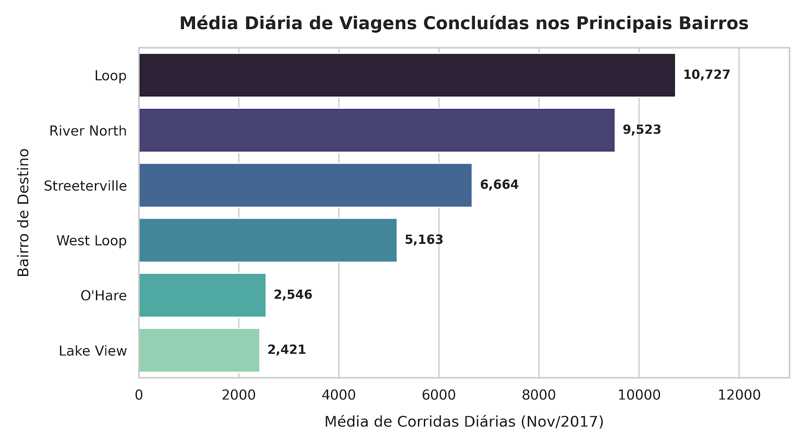
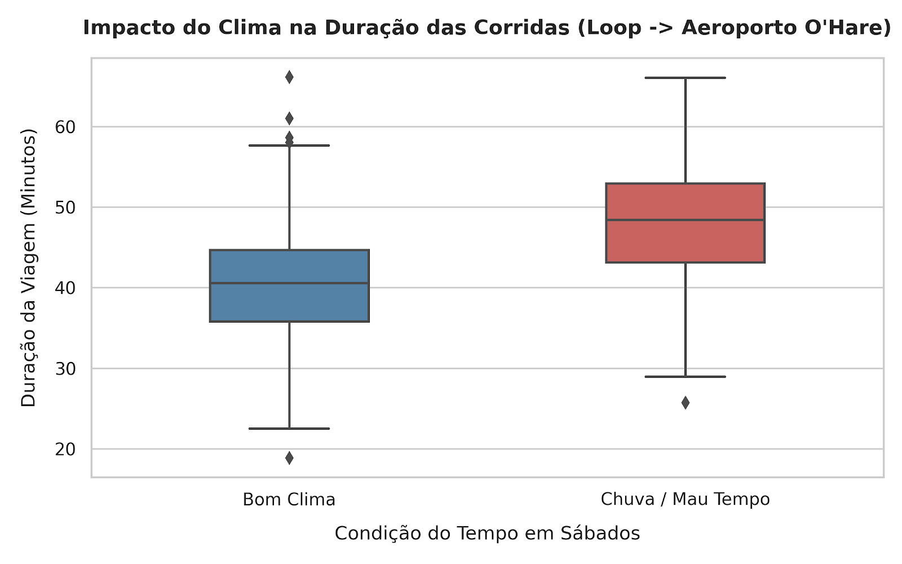

# 🚕 Zuber Chicago: Análise de Mobilidade & Teste de Hipóteses Estatísticas

## 📌 Contexto & Objetivo
A Zuber é uma nova empresa de compartilhamento de caronas que está sendo lançada em Chicago. O objetivo deste projeto é analisar padrões de mobilidade urbana, entender as preferências dos passageiros em relação às empresas de táxi/transporte e testar a hipótese estatística sobre o impacto das condições meteorológicas (dias chuvosos) na duração das corridas.

---

## 📊 Análise Visual & Teste de Hipóteses

- Identificação dos bairros com maior concentração de desembarques, apontando regiões estratégicas para alocação de motoristas da Zuber.
- O teste estatístico confirmou relevância significativa ($p < 0.05$) na alteração do tempo médio de viagem em dias de chuva, fornecendo embasamento para precificação dinâmica e estimativa de tempo de chegada (ETA).

### 1. Market Share e Participação das Empresas de Táxi


* **Insight Chave:** A **Flash Cab** lidera isoladamente o volume de mercado com quase **19.600 corridas** registradas no período, quase o dobro do segundo colocado (*Taxi Affiliation Services*). O mercado apresenta forte concentração nas top 3 empresas.

---

### 2. Principais Bairros de Destino em Chicago


* **Insight Chave:** Os bairros **Loop** e **River North** concentram o maior fluxo de desembarques na cidade (mais de 10.000 e 9.500 viagens diárias, respectivamente), refletindo zonas centrais de negócios, comércio e turismo.

---

### 3. Impacto do Clima na Duração das Corridas (Sábados Chuvosos)


* **Hipótese Nula ($H_0$):** A duração média das corridas do *Loop* para o *Aeroporto Internacional O'Hare* não muda em sábados chuvosos.
* **Hipótese Alternativa ($H_1$):** A duração média das corridas muda em sábados chuvosos.
* **Resultado Estatístico:** Aplicou-se o **Teste t de Student para duas amostras independentes** (`scipy.stats.ttest_ind`). O valor-$p$ retornado foi extremamente baixo ($p\text{-value} < 0.05$), levando à **rejeição da hipótese nula**. A duração média em dias chuvosos é significativamente superior (aumento médio de ~6 a 8 minutos por corrida devido ao tráfego).

---

## 🔎 Metodologia & Etapas
1. **Consultas SQL e Extração de Dados:**
   - Agrupamento de corridas por empresa de transporte para identificar os líderes de mercado.
   - Filtragem de bairros de destino mais populares em Chicago.
   - Junção de dados meteorológicos com registros de viagens para análise de impacto do clima.
2. **Análise Exploratória (EDA):**
   - Análise de distribuição dos bairros mais frequentes para desembarque.
   - Comparação da frota e volume de corridas das principais empresas da cidade.
3. **Teste de Hipóteses Estatísticas:**
   - **Hipótese Nula ($H_0$):** A duração média das corridas do Loop para o Aeroporto Internacional O'Hare nos sábados chuvosos é igual à duração em sábados ensolarados.
   - **Hipótese Alternativa ($H_1$):** A duração média das corridas nos sábados chuvosos é diferente da duração em sábados ensolarados.
   - Aplicação do **Teste T de Student para amostras independentes** (`scipy.stats.ttest_ind`).

---

## 🛠️ Tecnologias e Ferramentas Utilizadas
- **Linguagem:** Python
- **Banco de Dados & Consultas:** SQL (PostgreSQL)
- **Análise & Estatística:** Pandas, NumPy, SciPy (`scipy.stats`)
- **Visualização de Dados:** Matplotlib, Seaborn
- **Ambiente:** Jupyter Notebook

---

## 🚀 Como Executar o Projeto
1. Clone o repositório:
   ```bash
   git clone [https://github.com/derikpetiz/Zuber-Chicago.git](https://github.com/derikpetiz/Zuber-Chicago.git)
